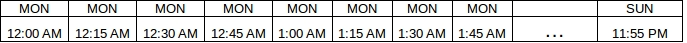
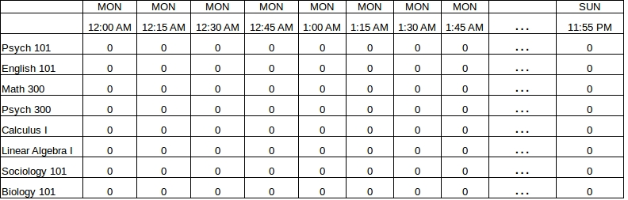

# Linear Programming with Kotlin Part III - Generating Multi-day Schedules

In [Part I of this series](http://tomstechnicalblog.blogspot.com/2018/01/kotlinforoperationalplanningandoptimiza.html) I introduced binary programming with [Kotlin](http://kotlinlang.org/) and [ojAlgo](http://ojalgo.org/). In [Part II](http://tomstechnicalblog.blogspot.com/2018/01/kotlin-for-linear-programming-part-ii.html), I introduced continuous variables and optimization concepts. In this section, I am going to present something more ambitious and useful: generating mutli-day schedules. This can be applied to scheduling problems such as staffing, manufacturing, transportation, sport team event planning, and even classroom allocation.

On a side note, the first article in this series spurred the largest spike in my blog's short history (about 13K views in one night) primarily because of this [YCombinator discussion thread here](https://news.ycombinator.com/item?id=16234067). It is always enlightening to see a deluge of people weighing in on a topic like this. For instance, it's interesting to see how people react to Kotlin being used for mathematical modeling. Some will insist that dynamic or math-focused languages are more productive for this purpose (e.g. [Julia](https://julialang.org/) and the [JuMP library](https://jump.readthedocs.io/en/latest/quickstart.html#creating-a-model)). Others express a sentiment that these dynamic/math-focused languages do not fit well into a production environment, and the JVM is inevitable in those cases. Anyway I digress, but it is just interesting to see what people value at the expense of other features.

I started building [okAlgo](https://github.com/thomasnield/okAlgo/blob/master/README.md) which is a Kotlin idiomatic extension to ojAlgo. This will be the first article in the series where I take it for a test-drive, and hopefully will beautify ojAlgo a bit more. I would also love to see ojAlgo ported to [Kotlin/Native](https://kotlinlang.org/docs/reference/native-overview.html) in time.

Back to the problem: It is one thing to create an app that allows you to input events into a calendar. It is another for it to automatically schedule the events for you! Rather than relying on iterative brute-force tactics to fit classes into a schedule (which can be hopelessly inefficent), we can achieve this magic one-click generation of a schedule using the power of mathematical modeling.

In this article, we will generate a weekly university class schedule against one classroom. We will plot the occupation state grid on two dimensions: classes vs timeline. If we wanted to schedule against multiple rooms, that would be three dimensions: classes vs timeline vs room. We will stick with the former for now and do 2 dimensions. The latter will likely be the next article in this series.

## The Problem

You need a one-click application to schedule university classes against a single classroom. These classes have differing lengths and may "repeat" throughout the week. Here are the classes:

* Psych 101 (1 hour, 2 sessions/week)
* English 101 (1.5 hours, 2 sessions/week)
* Math 300 (1.5 hours, 2 sessions/week)
* Psych 300 (3 hours, 1 session/week)
* Calculus I (2 hours, 2 sessions/week)
* Linear Algebra I (2 hours, 3 sessions/week)
* Sociology 101 (1 hour, 2 sessions/week)
* Biology 101 (1 hour, 2 sessions/week)


Each repetition must start at the same time of day. The day should be broken up in discrete 15 minute increments, and classes can only be scheduled on those increments. In other words, a class can only start on the :00, :15, :30, or :45 of the hour.

The operating week is Monday through Friday. The operating day is as follows with a break from 11:30AM to 1:00PM:

* 8:00AM-11:30AM
* 1:00PM-5:00PM

Classes must be scheduled within these times.

Create a linear/integer programming model that schedules these classes with no overlap and complies with these requirements.

## Laying the Groundwork

The _very_ first thing you should notice about this problem is how everything is broken up into "15 minute" blocks. This is not a continuous/linear problem but rather a discrete one, which is how most schedules are built. Imagine that we have created a timeline for the _entire_ week broken up in 15 minute blocks, like this:



Note that the "..."  is just a placeholder since we do not have enough room to display the 672 blocks for the week (because 672 = 7 days \* 24 hours \* 4 blocks in an hour).

Now let's expand the concept and make the classes a vertical axis against the timeline. Each intersection is a "slot" that can be 1 or 0. This binary will serve to indicate whether or not that "slot" is the start time for the first recurrence of that class. We will set them all to 0 for now as shown below:



This grid is crucial to thinking about this problem logically. It will make an effective visual aid because mathematical constraints will focus on regions within the grid.

On the Kotlin side, let's get our core framework set up. First let's improvise a DSL to make ojAlgo a little easier to work with. Note I am creating an extension to ojAlgo called [okAlgo](https://github.com/thomasnield/okAlgo/blob/master/README.md), which will create some nice Kotlin idioms. But for now, this should work.

```kotlin
import org.ojalgo.optimisation.ExpressionsBasedModel
import org.ojalgo.optimisation.Variable

// declare model
val model = ExpressionsBasedModel()

val funcId = AtomicInteger(0)
val variableId = AtomicInteger(0)
fun variable() = Variable(variableId.incrementAndGet().toString().let { "Variable$it" }).apply(model::addVariable)
fun addExpression() = funcId.incrementAndGet().let { "Func$it"}.let { model.addExpression(it) }
```

We are going to take advantage of Java 8's great LocalDate/LocalTime API to make calendar work easier. Let's set up our core parameters like so:

```kotlin
import java.time.LocalDate
import java.time.LocalTime


// Any Monday through Friday date range will work
val operatingDates = LocalDate.of(2017,10,16)..LocalDate.of(2017,10,20)
val operatingDay = LocalTime.of(8,0)..LocalTime.of(17,0)


val breaks = listOf<ClosedRange<LocalTime>>(
        LocalTime.of(11,30)..LocalTime.of(13,0)
)


// classes
val scheduledClasses = listOf(
        ScheduledClass(id=1, name="Psych 101",hoursLength=1.0, repetitions=2),
        ScheduledClass(id=2, name="English 101", hoursLength=1.5, repetitions=3),
        ScheduledClass(id=3, name="Math 300", hoursLength=1.5, repetitions=2),
        ScheduledClass(id=4, name="Psych 300", hoursLength=3.0, repetitions=1),
        ScheduledClass(id=5, name="Calculus I", hoursLength=2.0, repetitions=2),
        ScheduledClass(id=6, name="Linear Algebra I", hoursLength=2.0, repetitions=3),
        ScheduledClass(id=7, name="Sociology 101", hoursLength=1.0, repetitions=2),
        ScheduledClass(id=8, name="Biology 101", hoursLength=1.0, repetitions=2)
)


data class ScheduledClass(val id: Int,
                          val name: String,
                          val hoursLength: Double,
                          val repetitions: Int,
                          val repetitionGapDays: Int = 2)
```

The `repetitionGapDays` is the minimum number of days need between each recurrence's start time. For instance, since `Psych 100` requires 2 repetitions and defaults to a 2 day gap, if the first class was on MONDAY at 8AM then the second repetition must be scheduled at least 2 days (48 hours) later, which is WEDNESDAY at 8AM. All classes will default to a 2-day gap.

The `Block` class will represent each discrete 15-minute time period. We will use a Kotlin `Sequence` in combination with Java 8's `LocalDate/LocalTime` API to generate all of them for the entire planning window. We will also create a few helper properties to extract the `timeRange` as well as whether it is `withinOperatingDay`. The `withinOperatingDay` property will proactively determine if this `Block` is within an operating day.


```kotlin
data class Block(val dateTimeRange: ClosedRange<LocalDateTime>) {

  val timeRange = dateTimeRange.let {
     it.start.toLocalTime()..it.endInclusive.toLocalTime()
  }

  val withinOperatingDay get() =
      breaks.all { timeRange.start !in it } && timeRange.start in operatingDay


    companion object {

        // Operating blocks
        val all by lazy {
            generateSequence(operatingDates.start.atStartOfDay()) {
                it.plusMinutes(15).takeIf {
                  it.plusMinutes(15) <= operatingDates.endInclusive.atTime(23,59)
                }
            }.map { Block(it..it.plusMinutes(15)) }
             .toList()
        }
    }
}
```

Note I am going to initialize items for each domain object using a  [`lazy { }` delegate](https://kotlinlang.org/docs/reference/delegated-properties.html#lazy). This is to prevent circular construction issues.

Finally, the `Slot` class will represent an intersection between a `ScheduledClass` and a `Block`. We will generate all of them by pairing every `ScheduledClass` with every `Block`. We will also create a `binary()` ojAlgo variable which will be fixed to `0` if the `Block` is not operable.

```kotlin
data class Slot(val block: Block, val session: ScheduledClass) {
    val occupied = variable().binary()

    init {
      if (!block.withinOperatingDay) occupied.level(0)
    }

    companion object {

        val all by lazy {
            Block.all.asSequence().flatMap { b ->
                ScheduledClass.all.asSequence().map { Slot(b,it) }
            }.toList()
        }
    }
}
```
