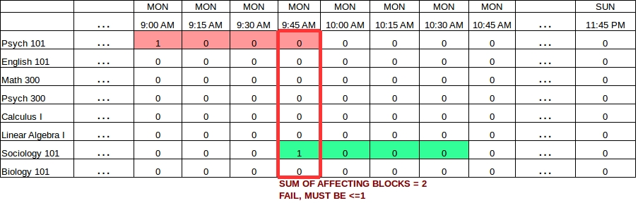
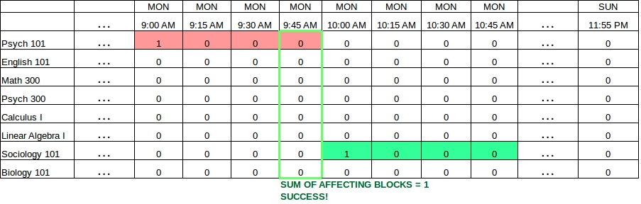
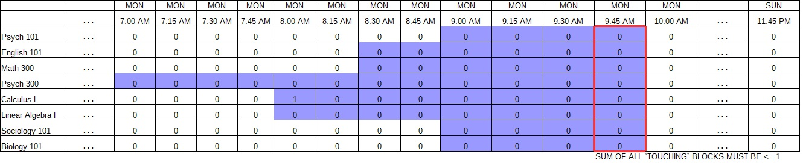
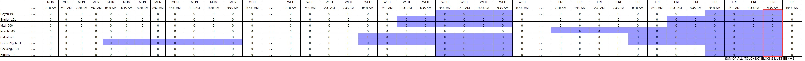

# Linear Programming with Kotlin Part III - Generating Multi-day Schedules


In [Part I of this series](http://tomstechnicalblog.blogspot.com/2018/01/kotlinforoperationalplanningandoptimiza.html) I introduced binary programming with [Kotlin](http://kotlinlang.org/) and [ojAlgo](http://ojalgo.org/). In [Part II](http://tomstechnicalblog.blogspot.com/2018/01/kotlin-for-linear-programming-part-ii.html), I introduced continuous variables and optimization concepts. In this section, I am going to present something more ambitious and useful: generating multi-day schedules. This can be applied to scheduling problems such as staffing, manufacturing, transportation, classroom allocation, and even sport event planning.

I started building [okAlgo](https://github.com/thomasnield/okAlgo/blob/master/README.md) which contains Kotlin idiomatic extensions to ojAlgo. Hopefully I will get a chance to release this soon.

It is one thing to create an app that allows you to input events into a calendar. It is another for it to automatically schedule the events for you. Rather than relying on iterative brute-force tactics to fit events into a schedule (which can be hopelessly inefficent), we can achieve magic one-click generation of a schedule using the power of mathematical modeling.

In this article, we will generate a weekly university class schedule against one classroom. We will plot the occupation state grid on two dimensions: classes vs timeline of 15-minute blocks. If we wanted to schedule against multiple rooms, that would be three dimensions: classes vs timeline vs room. We will stick with the former for now and do 2 dimensions. The latter will likely be another article in this series.

>Before I start, I found a challenging but useful [Coursera class on discrete optimization](https://www.coursera.org/learn/discrete-optimization/). This class is fairly ambitious and I hope to find time to complete it. It goes into different techniques to build optimization models from scratch using Python, Java, or any other platform of your choice. So far I highly recommend this class if you want to commit 10-15 hours a week to this topic.

## The Problem

You need a one-click application to schedule university classes against a single classroom. These classes have differing lengths and may "repeat" throughout the week:

* Psych 101 (1 hour, 2 sessions/week)
* English 101 (1.5 hours, 2 sessions/week)
* Math 300 (1.5 hours, 2 sessions/week)
* Psych 300 (3 hours, 1 session/week)
* Calculus I (2 hours, 2 sessions/week)
* Linear Algebra I (2 hours, 3 sessions/week)
* Sociology 101 (1 hour, 2 sessions/week)
* Biology 101 (1 hour, 2 sessions/week)


Each session must start at the same time of day. The day should be broken up in discrete 15 minute increments, and classes can only be scheduled on those increments. In other words, a class can only start/end on the :00, :15, :30, or :45 of the hour.

The operating week is Monday through Friday. The operating day is as follows with a break from 11:30AM to 1:00PM:

* 8:00AM-11:30AM
* 1:00PM-5:00PM

Classes must be scheduled within these times.

**OBJECTIVE: Create a discrete programming model that schedules these classes with no overlap and complies with these requirements.**

## Laying the Groundwork

The _very_ first thing you should notice about this problem is how everything is broken up into "15 minute" blocks. This is not a continuous/linear problem but rather a discrete one, which is how most schedules are built. Imagine that we have created a timeline for the _entire_ week broken up in 15 minute blocks, like this:


Note that the "..."  is just a collapsed placeholder since we do not have enough room to display the 672 blocks for the week (672 = 7 days \* 24 hours \* 4 blocks in an hour).

Now let's expand this concept and make the classes an axis against the timeline. Each intersection is a "slot" that can be 1 or 0. This binary will serve to indicate whether or not that "slot" is the start time for the first recurrence of that class. We will set them all to 0 for now as shown below:


This grid is crucial to thinking about this problem logically. It will make an effective visual aid because mathematical constraints will focus on regions within the grid.

On the Kotlin side, let's get our infrastructure set up. First let's improvise a DSL to make ojAlgo a little easier to work with. Note I am creating an extension to ojAlgo called [okAlgo](https://github.com/thomasnield/okAlgo/blob/master/README.md), which will create some nice Kotlin idioms. But for now, this should work.

```kotlin
import org.ojalgo.optimisation.ExpressionsBasedModel
import org.ojalgo.optimisation.Variable
import java.util.concurrent.atomic.AtomicInteger

// declare model
val model = ExpressionsBasedModel()


// improvised DSL
val funcId = AtomicInteger(0)
val variableId = AtomicInteger(0)
fun variable() = Variable(variableId.incrementAndGet().toString().let { "Variable$it" }).apply(model::addVariable)
fun addExpression() = funcId.incrementAndGet().let { "Func$it"}.let { model.addExpression(it) }

```

We are going to take advantage of Java 8's great LocalDate/LocalTime API to make calendar work easier. Let's set up our core parameters like so:

```kotlin
import java.time.LocalDate
import java.time.LocalTime


// Any Monday through Friday date range will work
val operatingDates = LocalDate.of(2017,10,16)..LocalDate.of(2017,10,20)
val operatingDay = LocalTime.of(8,0)..LocalTime.of(17,0)


val breaks = listOf<ClosedRange<LocalTime>>(
        LocalTime.of(11,30)..LocalTime.of(13,0)
)


// classes
val scheduledClasses = listOf(
        ScheduledClass(id=1, name="Psych 101",hoursLength=1.0, repetitions=2),
        ScheduledClass(id=2, name="English 101", hoursLength=1.5, repetitions=3),
        ScheduledClass(id=3, name="Math 300", hoursLength=1.5, repetitions=2),
        ScheduledClass(id=4, name="Psych 300", hoursLength=3.0, repetitions=1),
        ScheduledClass(id=5, name="Calculus I", hoursLength=2.0, repetitions=2),
        ScheduledClass(id=6, name="Linear Algebra I", hoursLength=2.0, repetitions=3),
        ScheduledClass(id=7, name="Sociology 101", hoursLength=1.0, repetitions=2),
        ScheduledClass(id=8, name="Biology 101", hoursLength=1.0, repetitions=2)
)


data class ScheduledClass(val id: Int,
                          val name: String,
                          val hoursLength: Double,
                          val repetitions: Int,
                          val repetitionGapDays: Int = 2)
```

The `repetitionGapDays` is the minimum number of days needed between each recurrence's start time. For instance, since `Psych 100` requires 2 repetitions and defaults to a 2 day gap, if the first class was on MONDAY at 8AM then the second repetition must be scheduled at least 2 days (48 hours) later, which is WEDNESDAY at 8AM. All classes will default to a 2-day gap.

The `Block` class will represent each discrete 15-minute time period. We will use a Kotlin `Sequence` in combination with Java 8's `LocalDate/LocalTime` API to generate all of them for the entire planning window. We will also create a few helper properties to extract the `timeRange` as well as whether it is `withinOperatingDay`. The `withinOperatingDay` property will proactively determine if this `Block` is within an operating day.


```kotlin
data class Block(val dateTimeRange: ClosedRange<LocalDateTime>) {

  val timeRange = dateTimeRange.let {
     it.start.toLocalTime()..it.endInclusive.toLocalTime()
  }

  /** indicates if this block is zeroed due to operating day/break constraints */
  val withinOperatingDay get() =  breaks.all { timeRange.start !in it } &&
          timeRange.start in operatingDay &&
          timeRange.endInclusive in operatingDay

    companion object {

        // Operating blocks
        val all by lazy {
            generateSequence(operatingDates.start.atStartOfDay()) {
                it.plusMinutes(15).takeIf {
                  it.plusMinutes(15) <= operatingDates.endInclusive.atTime(23,59)
                }
            }.map { Block(it..it.plusMinutes(15)) }
             .toList()
        }
    }
}
```

Note I am going to initialize items for each domain object using a  [`lazy { }` delegate](https://kotlinlang.org/docs/reference/delegated-properties.html#lazy). This is to prevent circular construction issues.

Finally, the `Slot` class will represent an intersection between a `ScheduledClass` and a `Block`. We will generate all of them by pairing every `ScheduledClass` with every `Block`. We will also create a `binary()` ojAlgo variable which will be fixed to `0` if the `Block` is not within the operating day.

```kotlin
data class Slot(val block: Block, val scheduledClass: ScheduledClass) {
    val occupied = variable().apply { if (block.withinOperatingDay) binary() else level(0) }

    companion object {

        val all by lazy {
            Block.all.asSequence().flatMap { b ->
                ScheduledClass.all.asSequence().map { Slot(b,it) }
            }.toList()
        }
    }
}
```

## Coming Up with a Model

In the first [article in this series](http://tomstechnicalblog.blogspot.com/2018/01/kotlinforoperationalplanningandoptimiza.html), I showed an approach to capture the necessary contiguous blocks for a given session. I found this approach to scale poorly with ojAlgo, although there are changes in the upcoming release (support for ordered sets) that might work with this approach. I could also drop in a $10K [CPLEX license](https://www.ibm.com/analytics/data-science/prescriptive-analytics/cplex-optimizer) which also might execute a solve quickly.

But I like things to remain free and open-source where possible, so I concentrated hard and came up with a better mathematical model. It is highly abstract but powerful and effective for this particular problem.

Again, we are going to label each `Slot` as `1` or `0` *to indicate the start of the first class repetition*. Here is one possible iteration the solver may come up with, where the first Psych 101 class starts on MON 9:00AM and Sociology 101 starts on MON 9:45AM. Here it is on our grid:



Study this scenario closely. Do you see a pattern for an invalid case? In the MON 9:45AM block, Psych 101 (which requires four blocks) and Sociology 101 (which also requires four blocks) are in conflict with each other. Visually, you might be able to see the conflict. But how do you describe it?

The sum of scheduled class blocks that "affect" the 9:45AM block must be less than or equal to 1. A sum of `1` effectively means only one class is taking up that block, and `0` means no classes are occupying that block at all (also valid). This particular case fails because the sum of "affecting" blocks is 2.

If we shifted Sociology 101 to 10:00AM, the sum would then be `1` and all is good.



We need to apply this logic to every block across the entire timeline, querying for earlier slots for each class that occupy this block, and dictate their sum must be no greater than 1. This abstract but powerful idea achieves everything we need. Here is what this looks like in practice below, where all slots affecting the 9:45AM block are highlighted in blue. All of these blue blocks must sum to no more than 1.



This can even account for the recurrences too. After all, We put a `1` in a slot to indicate the candidate start time _of the first class_. If we were looking at the 9:45AM block on Friday, we would query for time slots earlier in the week that would result in the 9:45AM block being occupied. Here is a wide visual below. The sum of these blue slots must be no greater than 1.



Okay is your head spinning yet? The power of this model is not so much the math, but the ability for each block to query the slots that impact it and mandate they must sum to no more than 1. That is where the hard work will happen, and Kotlin's stdlib can nail this effectively. The benefit is we do not have create any new variables, and can constrain the existing slot binary variables with a series of sum constraints.


## Extracting Recurrences and Affected Slots

Wrangling and transforming data is tedious, and it is the unglamorous part of data science where 90% of the work occurs. It is for this reason Python has rapidly stood toe-to-toe with R, but I think Kotlin can do even better than Python with its extensibility, type-safety, and higher-order functions.

What we need to do first is identify the "groups" of slots for each class, and by "group" I mean an entire set of recurrences across the week. The star of this codebase is is going to be this Kotlin extension function, which will accomplish just that.

```kotlin
fun <T> List<T>.rollingRecurrences(slotsNeeded: Int, gap: Int, recurrences: Int) =
        (0..size).asSequence().map { i ->
            (1..recurrences).asSequence().map { (it - 1) * gap }
                    .filter { it + i < size}
                    .map { r ->
                        subList(i + r, (i + r + slotsNeeded).let { if (it > size) size else it })
                    }.filter { it.size == slotsNeeded }
                    .toList()
        }.filter { it.size == recurrences }
```

I will let you dive deep into the implementation on your own later. For now it is more productive to cover what it accomplishes: taking any `List<T>` and doing a specialized `windowed()` operation that injects a `gap` between each grouping. Note the `gap` is the number of items between each start of the window. For instance, we can take the numbers 1..20 and break them up in groups of 4, with a gap of 6 between each recurrence start, and have 3 recurrences.

```kotlin
fun main(args: Array<String>) {

    (1..20).toList().rollingRecurrences(slotsNeeded = 4, gap = 6, recurrences = 3)
            .forEach { println(it) }
}
```

**OUTPUT:**
```
[[1, 2, 3, 4], [7, 8, 9, 10], [13, 14, 15, 16]]
[[2, 3, 4, 5], [8, 9, 10, 11], [14, 15, 16, 17]]
[[3, 4, 5, 6], [9, 10, 11, 12], [15, 16, 17, 18]]
[[4, 5, 6, 7], [10, 11, 12, 13], [16, 17, 18, 19]]
[[5, 6, 7, 8], [11, 12, 13, 14], [17, 18, 19, 20]]
```

We can use this extension function to handle the class repetitions, and generate all possible permutations within our time planning window of one week. We can then use that to find slots for a particular class that affect a particular block, as implemented with our `affectingSlotsFor()` function shown below. We will also set our constraints dictating

```kotlin
data class ScheduledClass(val id: Int,
                          val name: String,
                          val hoursLength: Double,
                          val repetitions: Int,
                          val repetitionGapDays: Int = 2) {

    /** the # of slots between each recurrence */
    val gapLengthInSlots = repetitionGapDays * 24 * 4

    /** the # of slots needed for a given occurrence */
    val slotsNeeded = (hoursLength * 4).toInt()

    /** yields slots for this given scheduled class */
    val slots by lazy {
        Slot.all.asSequence().filter { it.scheduledClass == this }.toList()
    }

    /** yields slot groups for this scheduled class */
    val slotGroups by lazy {
        slots.rollingRecurrences(slotsNeeded = slotsNeeded, gap = gapLengthInSlots, recurrences = repetitions)
    }

    /** yields slots that affect the given block for this scheduled class */
    fun affectingSlotsFor(block: Block) = slotGroups.asSequence()
            .filter { it.flatMap { it }.any { it.block == block } }
            .map { it.first().first() }

    companion object {
        val all by lazy { scheduledClasses }
    }
}
```
